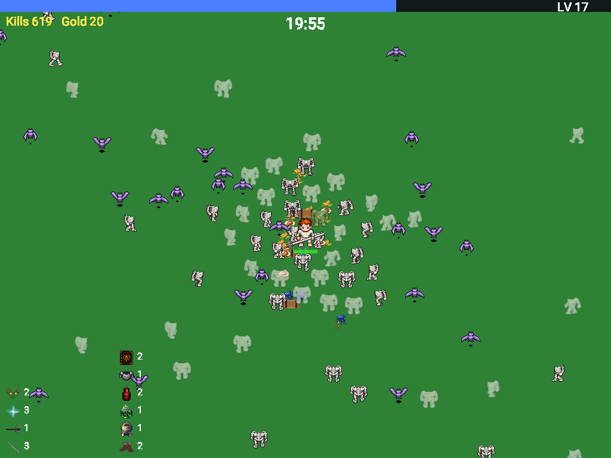
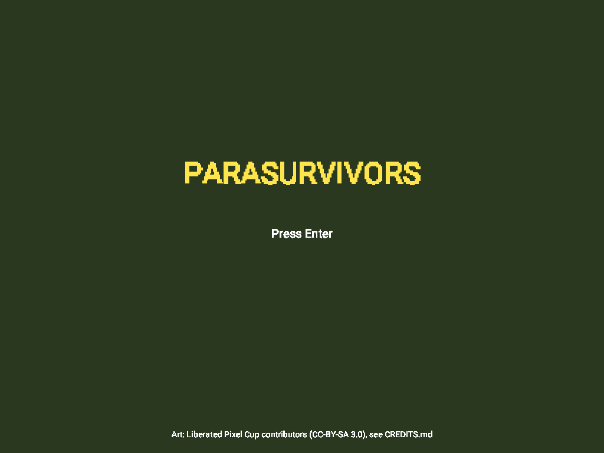
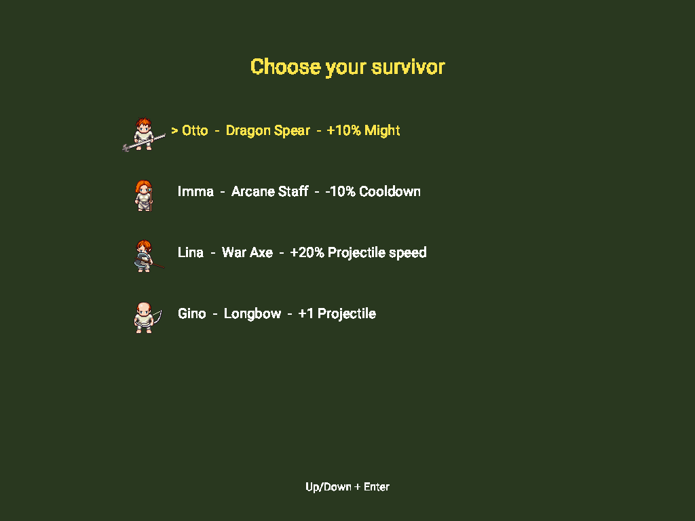
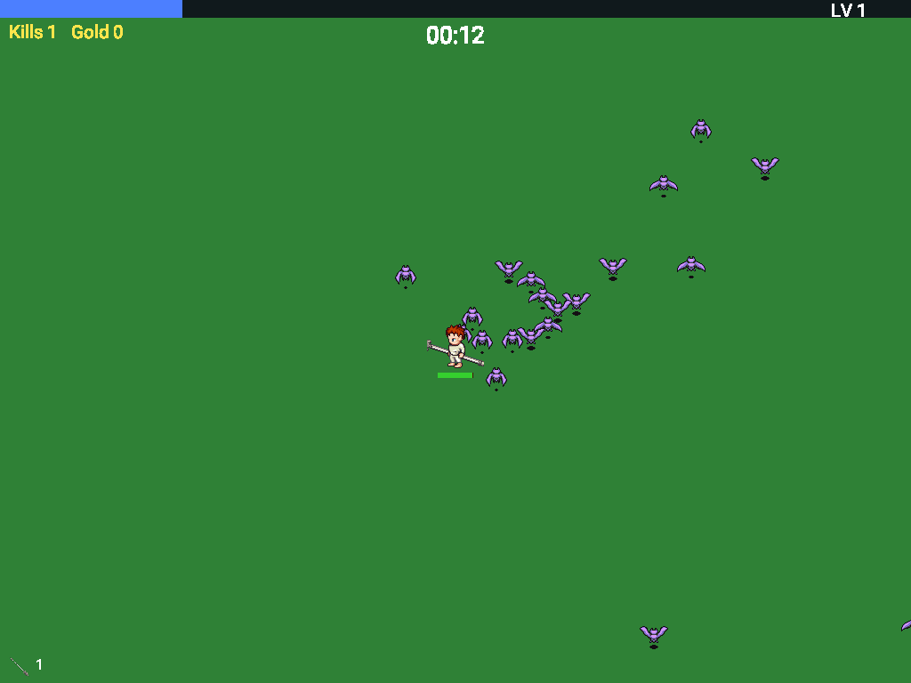
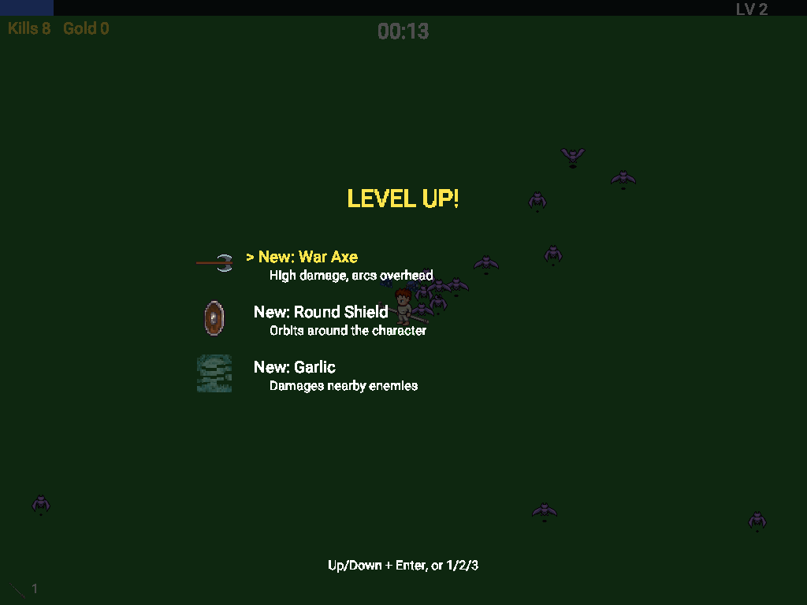
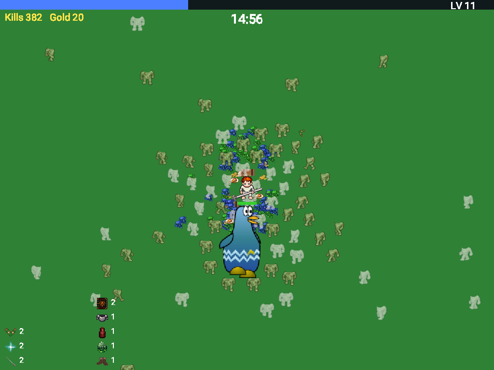
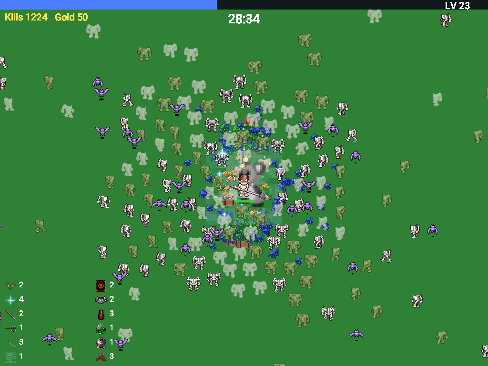
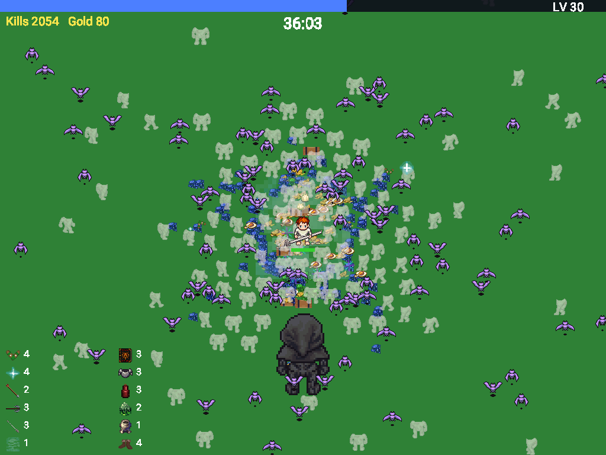
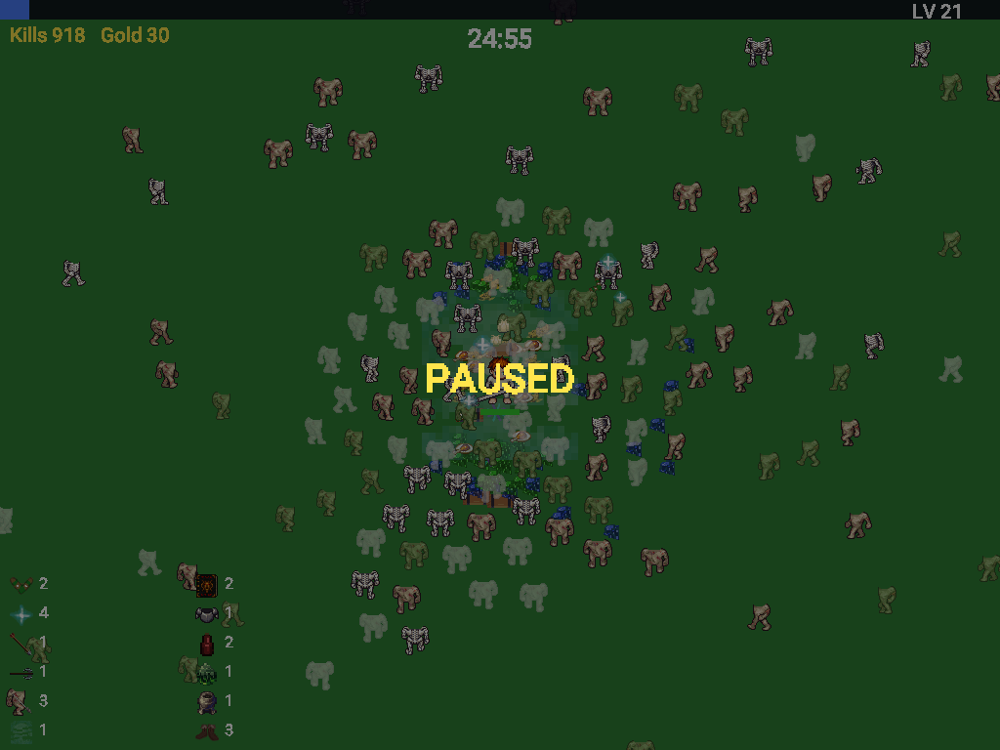
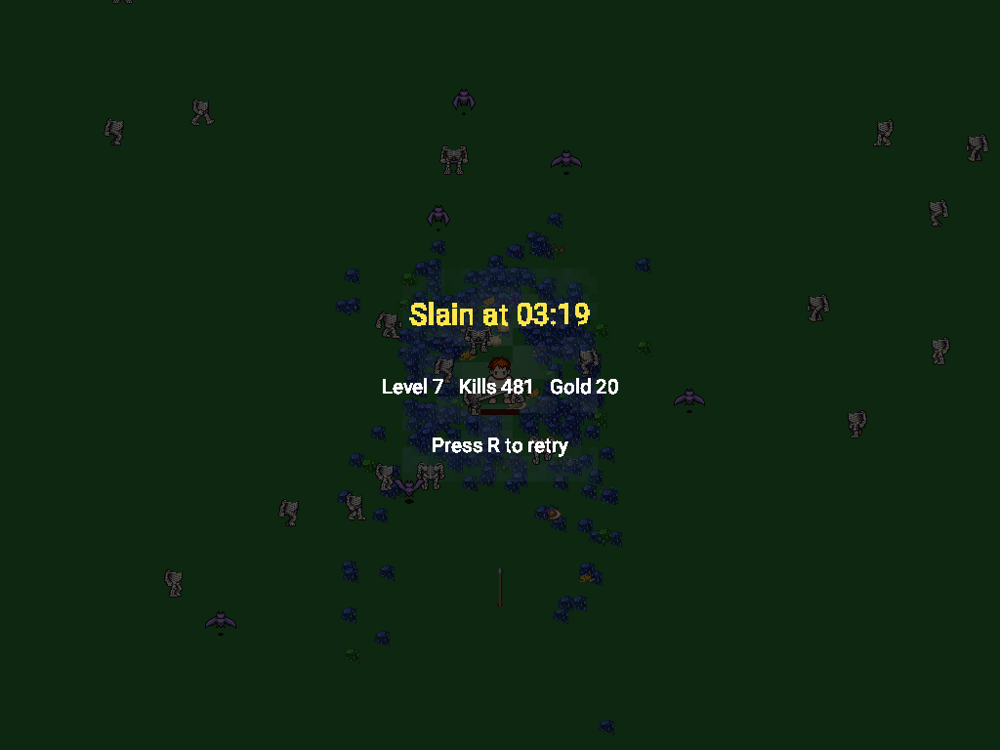

# Parasurvivors

A small, fast Vampire Survivors clone written in [Nim](https://nim-lang.org) on Zach Oakes'
[paranim](https://github.com/paranim/paranim) stack. Pick a survivor, walk around a field, and let your
weapons fire on their own while the waves get bigger. Survive 30 minutes and the Reaper comes for you.



The whole game is about 2200 lines of Nim. All game state lives in a
[pararules](https://github.com/paranim/pararules) session as `(id, attribute, value)` facts, and every
sound effect is a MIDI phrase rendered at startup, so the repository has no audio files at all.

## Play it

You need Nim 2.x (`nimble` comes with it) and, on Linux, OpenGL headers plus the X11 development
packages (`libgl-dev libx11-dev libxrandr-dev libxinerama-dev libxcursor-dev libxi-dev` on Debian/Ubuntu,
`libgl libx11 libxrandr libxinerama libxcursor libxi` on Arch). Then:

```sh
git clone https://github.com/PDepaula/parasurvivors
cd parasurvivors
nimble install -d -y        # fetch paranim, pararules, paratext, parasound, paramidi ...
nimble build -d:release     # ~1 minute the first time
./parasurvivors
```

The sprites and font are committed, so you do not need to run the asset pipeline to play. If you
change `tools/fetch_assets.sh` and want to regenerate them, `nimble assets` does it (needs `curl`,
`unzip` and ImageMagick 7).

### Controls

| Key | Action |
|---|---|
| `W A S D` or arrow keys | move |
| `Enter` or `Space` | confirm a menu choice |
| `Up` / `Down` | move the menu cursor |
| `1` `2` `3` | pick a level-up directly |
| `Esc` or `P` | pause / resume |
| `R` | retry after a game over |

Weapons fire by themselves. Your only job is to not get touched.

## A run, in pictures

Press Enter on the title screen and choose a survivor. Each one starts with a different weapon and a
small permanent perk.





| Survivor | Starting weapon | Perk | HP |
|---|---|---|---|
| Otto | Dragon Spear | +10% might | 120 |
| Imma | Arcane Staff | -10% cooldown | 100 |
| Lina | War Axe | +20% projectile speed | 90 |
| Gino | Longbow | +1 projectile | 100 |

Each survivor carries their starting weapon and swings, draws or casts it every time it fires. Weapons
picked up later fire on their own without a body animation.

The first minute is bats. Kill them, pick up the blue gems they drop, and watch the XP bar at the top.



Every time the bar fills, the game pauses and offers three upgrades: a new weapon, a level for a weapon
you own, or a passive item. Six weapon slots, six passive slots, eight levels per weapon.



| Weapon | Behaviour |
|---|---|
| Dragon Spear | lunges in the direction you face, passes through everything |
| Arcane Staff | homes in on the nearest enemy |
| Longbow | arrows fly in the direction you face |
| War Axe | high damage, arcs up and falls back down |
| Boomerang | flies out, curves back to you, hits on both legs |
| Garlic | damages everything within a ring around you |
| Round Shield | shields orbit around you |

| Passive | Per level |
|---|---|
| Spinach | +10% damage |
| Armor | -1 incoming damage |
| Hollow Heart | +20% max HP |
| Pummarola | +0.2 HP/s regen |
| Empty Tome | -8% cooldown |
| Wings | +10% move speed |
| Attractorb | +50% pickup range |

Zombies join at minute 1, skeletons at 3, mudmen at 5, ghosts at 12. Enemy HP grows 12% per minute and
the crowd caps at 300 on screen. Bosses arrive on a schedule: the Parakeet at 3, 12 and 20 minutes, the
Koala at 8, 15 and 25, and the Reaper at 30. Bosses drop a chest that levels a weapon you own.





Past minute 30 the Reaper shows up: 65535 HP, faster than you, and it deals 999 damage on touch.
This run is the immortal `-d:autoplay` test build, which is the only reason it is still going at 36:03.



`Esc` pauses. When your HP hits zero the run ends with your time, level, kills and gold, and `R` starts
a new one.





## Build flags

All of these go after `nimble build` or `nim c`:

| Flag | Effect |
|---|---|
| `-d:release` | optimised build; also hides the console window on Windows |
| `-d:noaudio` | skip audio entirely (no device opened, no soundfont rendered) |
| `-d:fastclock` | game clock runs 10x, for reaching late waves quickly |
| `-d:autoplay` | skip the menus, auto-pick the first level-up, player cannot die |
| `-d:perf` | print per-tick work time and enemy count every 5 game seconds |
| `-d:keyscript` | feed scripted key presses from `PS_KEYS` (see `tools/screenshots.sh`) |

`-d:fastclock -d:autoplay` together is the "reach minute 30 unattended" test.

## Tests and benchmark

```sh
nimble test                      # headless: data tables, systems, rules
cd tests && nim c -r -d:release --hints:off --outdir:../tmp bench.nim   # one tick with 300 enemies
```

## How it is put together

- `src/data.nim` — pure data: characters, weapons and their upgrade tables, passives, enemies, waves,
  boss schedule, XP curve. No engine imports, so the tests can load it headless.
- `src/rules.nim` — every piece of game state is a `(id, attribute, value)` fact in a pararules session;
  movement, cooldowns, spawning and level-ups are rules that react to `DeltaTime` and `Xp` changes.
- `src/systems.nim` — the few N x M loops (collision, pickups, attacks) as pure procs on plain seqs.
- `src/core.nim` — the per-frame `tick`: phase machine (title, select, running, level-up, paused, over),
  input, and the hand-off between rules and systems.
- `src/render.nim` — paranim instanced sprite batches, paratext HUD and menus.
- `src/audio.nim` — paramidi renders every sound effect and the music loop at startup, parasound plays them.
- `src/parasurvivors.nim` — GLFW window and main loop.
- `patches/pararules/engine.nim` — pararules 1.4.0 with a one-line fix (`patches/pararules/engine.diff`),
  swapped in via `patchFile` in `config.nims`. Without it `fireRules` copies a rule's whole match table
  once per queued `then`, which is O(N²) per tick with N per-entity rule firings. Upstream PR:
  [paranim/pararules#12](https://github.com/paranim/pararules/pull/12).

The design and the implementation plan the code was built from are in `docs/superpowers/`.

### Adding a weapon

Everything a weapon needs is data. To add one:

1. `src/data.nim`: add the value to `WeaponKind`, a `weaponDefs` row (pick a `motion`, a `sprite`,
   `drawScale`, `spin`; `anim` only matters if a survivor starts with it) and a `weaponUpgrades` row
   for levels 2-8.
2. If it needs new art: add an `icon NAME ...` line to `tools/fetch_assets.sh`, a `SprNAME` value to
   `Sprite`, run `nimble assets`. A sprite missing from `items.txt` fails to compile.
3. A new movement style is a new `Motion` value with a branch in `systems.attackPlan` (spawn) and
   `rules.moveProjectiles` (per tick), plus a test in `tests/test_systems.nim`.
4. `nimble test`, then `tools/screenshots.sh` to look at it.

### Performance notes

Every entity keeps a single `Pos` fact and every per-entity rule lists `(id, Pos, pos)` first and
`DeltaTime` last: pararules re-scans all partial matches of a join's parent when a fact reaches a
non-root join, so position updates must hit root joins. On the dev machine a 300-enemy tick costs
about 3.5 ms of rules and 2.5 ms of systems in a release build.

## Credits and licenses

The code is MIT. The art is not mine:

- Character and monster sprites are composed from
  [Liberated Pixel Cup](http://opengameart.org/content/lpc-collection) layers via the
  [Universal LPC Spritesheet Generator](https://github.com/liberatedpixelcup/Universal-LPC-Spritesheet-Character-Generator),
  CC-BY-SA 3.0 (each layer's authors, licenses and source pages are listed per file in
  `src/assets/CREDITS-lpc.csv`).
  The weapons the survivors hold and swing (dragon spear, staff, bow and arrow, war axe, round shield)
  are generator layers too.
- The bat, the grass tile and the chest are from the
  [LPC Base Assets](https://opengameart.org/content/liberated-pixel-cup-lpc-base-assets-sprites-map-tiles)
  by Charles Sanchez and Lanea Zimmerman.
- The pickup, passive and effect icons come from Tuomo Untinen's (reemax)
  ["\[LPC\] Items and game effects"](https://opengameart.org/content/lpc-items-and-game-effects),
  CC-BY-SA 3.0 / GPL (every contributor is named in `src/assets/CREDITS-lpc-items.txt`); the weapon
  icons are single frames cut from the generator layers above.
- The garlic is from bluecarrot16, Daniel Eddeland, Joshua Taylor and Richard Kettering's
  ["\[LPC\] Food"](https://opengameart.org/content/lpc-food), CC-BY-SA 3.0 / GPL 3.0 (contributors in
  `src/assets/CREDITS-lpc-food.txt`).
- The koala boss is the Super Koalio sprite from the [libgdx](https://github.com/libgdx/libgdx) tests
  (Apache 2.0); the parakeet boss is from Zach Oakes' [parakeet](https://github.com/paranim/parakeet) demo.
- Roboto is Google's, Apache 2.0. Instrument samples are
  [GeneralUser GS](https://schristiancollins.com/generaluser.php) by S. Christian Collins.

Full attribution, including every LPC contributor by name, is in
[`src/assets/CREDITS.md`](src/assets/CREDITS.md).
